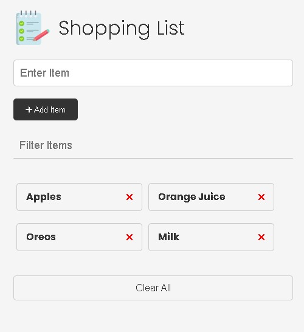

# Shopping List App

A simple, responsive Shopping List web app built using **HTML**, **CSS**, and **Vanilla JavaScript**.  
Users can **add**, **update**, **delete**, and **clear** shopping items with a clean and intuitive interface.

## ✨ Features

- Add new shopping items
- Update existing items
- Delete individual items
- Clear all items at once
- Filter items dynamically
- Clean, mobile-responsive UI

---

## 🚀 Technologies Used

- **HTML5** – Semantic layout and structure  
- **CSS3** – Responsive and modern styling  
- **JavaScript (Vanilla)** – DOM manipulation and interactivity

---

**Demo**: https://funny-froyo-2c7eb5.netlify.app/

